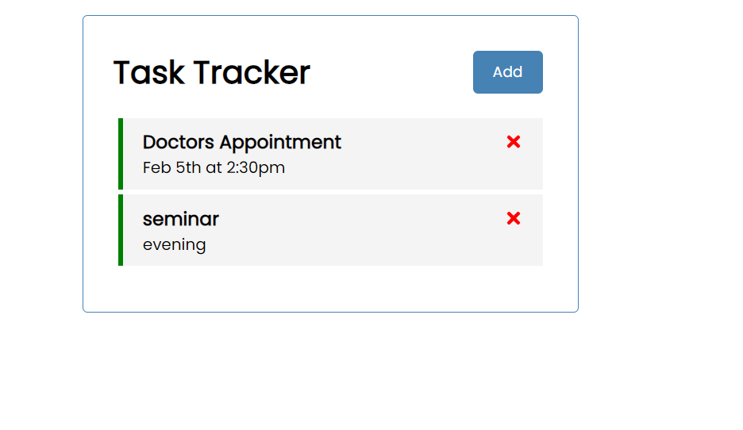

# Summary

## Important Note

<b>Master Branch:</b> Interacts with JSON server

<b>Task-Tracker-Firebase branch:</b> Interacts with Firebase

<i>
<ul>
    <li>Add task message, time and reminder status</li>
    <li>Delete the task:</li>
    <li>Update reminder on toggle</li>
    <li>Delete records</li>
    <li>All the task records are stored in Firebase</li>
    <li>Action are performed in realtime</li>
</ul>
</i>

## Screenshot

## Available Scripts

In the project directory, you can run:

### `npm start`

Runs the app in the development mode.\
Open [http://localhost:3000](http://localhost:3000) to view it in the browser.

The page will reload if you make edits.\
You will also see any lint errors in the console.

### `npm run build`

Builds the app for production to the `build` folder.\
It correctly bundles React in production mode and optimizes the build for the best performance.

### `npm run server`

Runs JSON server.\
First we need to install json-server using npm command

## View Live Demo at: 
https://task-tracker-2e6d8.web.app/

